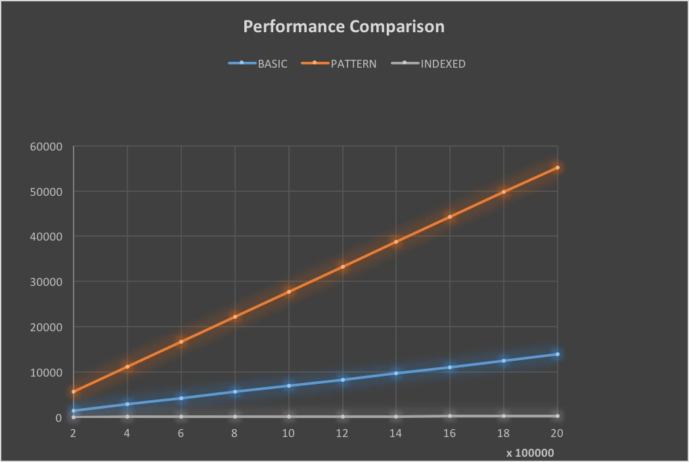

# Document Search - Case Study
## Synopsis:
create a working program to search relevant files for a given search term
or a single token, and return the result in order of relevance. Relevancy
is defined as number of times the exact term or phrase appears in the document.

## Running the Application:
1. Build the JAR file using: `./gradlew clean build`
2. Both unit and performance test are done during the above build process.
3. Run the JAR file using (`from build/libs`): `java -jar target-document-search-0.1.0.jar`
4. Test report can be found under `build/reports/index.html`
5. All information/intermediary logs are consoled out.

## Approach:
1. Implement a simple spring boot command line runner application to showcase
modularized development of varying versions of document search.
2. Gradle is used for task build
3. Following Utilities/API's/Approach were adopted for individual versions:
   1. `Brute Force (Basic search)`: Its a simple string search using StringUtils
       Where all files are searched for each of the search term (O(n)). The
       files are read to a string once per instance.
   2. `Regex Api (search)`: Pattern and Matcher components of Regex is used. Here
       again Regex pattern is compiled and searched for each of the search term
       (O(n)).
   3. `Indexed search`: All files are parsed, grouped and counted for each word
       and an index is created using Hashmap. This map is created per
       instance and used for a all term lookup. Which means, this approach does
       an entire file lookup only once (O(1)).
3. Both unit and performance test cases written using JUnit.
4. Ran performance model across all search type for 2M terms by running 10 iterations
   with 200K each.
5. Compared the numbers and Identified the best option. Also theorized how we
   can make it more scalable.

## Performance Analysis:
   Performance suite ran against 10 iterations each with 200K search terms.
   Search terms are randomly selected from a consolidated list of words in the provided
   files.
   Here is an illustrative comparison graph snapshot:
   {:height="20px" width="20px"}

## Recommendation for Scalability: <Placeholder>